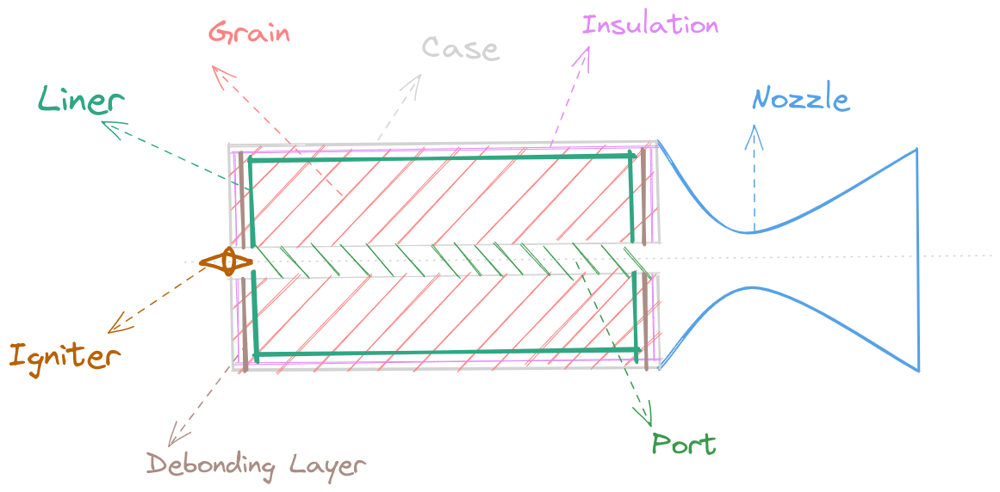

# 固体火箭发动机

---

## 主要特点

### 主要优点
1. 结构简单，零部件少因此可靠性高
2. 维护与使用相对方便，服役期较长
3. 药柱预装保存，可长期保持战备状态，立即发射
4. 启动迅速，善捕战机
5. 体积紧凑，便于装载和运输

### 主要缺点
1. 比冲较低
2. 工作时间较短，偏“爆发”
3. 发动机性能受气温影响大（燃速随初温不同而变化）
4. 可控性较差，一旦点燃必须自动烧完

## 设计流程

  

### 设计步骤
1. 预设计：定变参（ $p_{c}, \varepsilon, c_{d}, L_{c}, m_{t}$ ），确定推进剂
2. 详细设计：
    - 推进剂化学性质计算（热力学性能，比冲，燃烧温度，燃气分子量）
    - 药柱设计（几何形状，内弹道性能计算，结构完整性）
    - 燃烧稳定性验算
    - 发动机结构设计，受热以及强度分析
3. 应当注意，人工脱粘层较小，且只装在前后端，因此人工脱粘层会和衬层融合到一块进行设计。

### 研制阶段
1. 方案阶段：论证方案可行性，技术路径
2. 初样阶段：详细设计，验证指标，单项试验，完成设计图样，试制产品，迭代修改
3. 试样阶段：提供样机进行飞行试验，可靠性评估，技术冻结
4. 定型阶段：全面评定战术技术指标，鉴定验收，报请国家鉴定

### 技术要求
1. 工作性能
2. 质量指标
    - 比冲：$I_{sp}$，取决于推进剂等因素，详见[关于比冲的讨论](比冲.md)
    - 初始质量：$m_{i}$
    - 药柱质量：$m_{gr}=m_{p}$
    - 发动机质量比：$\lambda$
    $$\lambda=\frac{m_{gr}}{m_{i}}$$
    - 冲量质量比：$\lambda_{m_{i}}$
$$\lambda_{m_{i}}=\frac{I}{m_{i}}=\frac{m_{gr}}{m_{i}} I_{sp}=\lambda I_{sp} \,\,\,\,\,\,(\mathrm{N}\cdot\mathrm{s/kg})$$
3. 可靠，贮存，运输，安全，环保

### 经济要求
1. 降低成本
2. 合理设计

### 发展前景
1. 高性能，高可靠，长寿命，低成本，多需求
2. 提高工作压强（提高比冲，发挥推进剂的能量）
3. 高性能材料，优化设计，先进的制造技术
4. 推力矢量控制能力，双脉冲技术
5. HTPB推进剂改良，高能，低特征信号，洁净，安全

## 总体设计

### 设计任务
设计依据
1. 发动机用途
2. 性能指标（总冲、比冲及其偏差，推力方案，工作时间，推力控制，可靠性）
3. 约束条件（几何尺寸限制、工程限制）
4. 环境条件（贮存、运输、使用、飞行、勤务和经济）

### 发动机结构形式

1. 发动机主要结构：燃烧室、喷管及其连接结构
2. 与弹体布局的关系：
    - [多级火箭发动机和齐奥尔科夫斯基公式](齐奥尔科夫斯基公式.md)
    - 弹体布局：战斗部、发动机、控制系统、稳定系统等部位安排，外形、气动布局等
    - 弹道导弹：贴壁浇铸，圆筒两端半椭球，潜入式喷管，推力向量控制
    - 地空战术导弹：两级，助推（多根管状/速燃星形药柱）续航，内孔/高燃速端面
    - 空空战术导弹：单推力、助推续航两级不可分离双推力结构（较多），单双室
3. 与药柱的关系
    - 端面燃烧药柱：一维，工作时间长，推力小，燃气和室壁直接接触
    - 侧面燃烧药柱：二维，内孔燃烧，内外侧面燃烧
    - 端侧面同时燃烧：三维，多种外形
4. 选择外形的原则
    - 满足规定技术要求
    - 结构紧凑，质量轻
    - 工艺性良好，省钱节时

### 主要设计参数选择

1. 依质量最轻的原则确定直径和长径比：
    - 已知参数：总冲 $I$ ，推进剂（比冲 $I_{sp}$ ，密度 $\rho_{gr}$）
    - 求解：药柱质量 $m_{gr}$ ，药柱体积 $v_{gr}$
    $$m_{gr}=\frac{I}{I_{sp}},\,\,\,v_{gr}=\frac{m_{gr}}{\rho_{gr}}=\frac{I}{I_{sp}\rho_{gr}}$$
    - [发动机结构质量计算](发动机结构质量.md) 
    - 确定最佳半径：
    $$(8.28\pi r^{*\,2}_{c}-A_{p})(\pi r^{*\,2}_{c}-A_{p})^2=4\pi r^*_{c}A_{p}v_{gr}$$
    其中 $A_{p}$ 为初始通气面积。由此可以进一步求出燃烧室最佳长度 $L_{c}$：
    $$L^*_{c}=L^*_{gr}=\frac{v_{gr}}{\pi r^{*\,2}_{c}-A_{p}}$$
    最后可以得到最佳长径比 $\lambda^*$：
    $$\lambda^*=\frac{L^*_{c}}{r^*_{c}}=\frac{v_{gr}}{(\pi r^{*\,2}_{c}-A_{p})r^*_{c}}$$
2. 发动机工作压强（燃烧室压强）
    - 药柱正常燃烧，最小平衡压强不小于最低使用温度下的临界压强：
        $$P_{eg,min}(-TK)\geq P_{cr}(-TK)$$
    - 冲量质量比（单位质量发动机所能提供的冲量）最大
    详见[发动机喷口速度推导](比冲.md)，可以得到：
        $$V_{e}=\sqrt{\frac{2k}{k-1}RT^{*}\left[ 1-\left( \frac{p_{e}}{p_{c}} \right)^{\frac{k-1}{k}} \right]}$$
      其中 $k$ 为工质的比热比，$R$ 为燃烧产物的气体常数，$T^{*}$ 为总温，$p_{c}$ 为燃烧室的压强，$p_{e}$ 为出口截面压强，$p_{a}$ 为外界大气压， $p_{ad}$ 为设计高度的外界大气压，可以看出，燃烧室压强越大，比冲越高，但比冲的相对增量（加速度）越小。在总冲 $I$ 一定的情况下，存在最佳工作压强，使得冲质比最大
        $$\left(\frac{\partial m_{i}}{\partial p_{c}}\right)_{I}=0$$
        其中的 $m_{i}$ 为发动机总质量，包括：
        $$m_{i}=m_{c}+m_{n}+m_{ig}+m_{gr}+m_{stl}$$
        其中，$c,\,n,\,ig,\,gr,\,stl$ 代表燃烧室外壳、喷管、点火器、装药、剩余结构质量，只考察燃烧室外壳质量和装药质量随燃烧室压强变化的关系：
        $$\left(\frac{\partial m_{c}}{\partial p_{c}}+\frac{\partial m_{gr}}{\partial p_{c}}\right)_{I}=0$$
        代入总冲、装药质量和比冲的关系式，可以得到：
        $$\frac{1}{m_{gr}}\left(\frac{\partial m_{c}}{\partial p_{c}}\right)_{I}-\frac{1}{I_{sp}}\frac{\mathrm dI_{sp}}{\mathrm dp_{c}}=0$$
3. 选择喷管扩张比：
    $$\varepsilon=\frac{A_{e}}{A_{t}}=\frac{\left( \frac{2}{k+1} \right)^{\frac{1}{k-1}} \sqrt{\frac{k-1}{k+1}}}{\sqrt{ \left(\frac{p_{e}}{p_{c}}\right)^{\frac{1}{k}} - \left(\frac{p_{e}}{p_{c}}\right)^{\frac{k-1}{k}}}}$$
    - 推力最大原则（工作高度变化较大时，若燃烧室压强不变，取外界大气压平均值）
    - 冲质比最大原则（计算喷管质量、药柱质量随扩张比的变化，作图叠加，一般选欠膨胀）

### 壳体材料及其选择
1. 主要材料：高强度钢、超高强度钢、玻璃纤维、有机纤维增强复合材料
2. 常用壳体材料：
    - 钢：优质碳素结构钢、合金钢
    - 铝合金和钛合金
    - 纤维增强复合材料：玻璃纤维、有机纤维、碳纤维、石墨纤维、碳化硅纤维
3. 选择壳体材料的原则
    - 结构可靠性和质量小
    - 良好的加工工艺性
    - 材料来源丰富，经济性好

### 固体推进剂的选择
1. 种类：
    - 双基推进剂：硝化棉和硝化甘油
    - 复合推进剂：氧化剂、粘合剂、金属燃料、其他成分
    - 复合改性双基推进剂：NEPE
2. 选择原则：
    - 尽量高的能量特性（体积比冲 $I_{sp}\rho_{gr}$ 尽可能大）
    - 内弹道特性（燃速调节范围，推进剂压强指数 $n$ 低，燃速温度敏感系数小）
    - 良好的燃烧特性（小侵蚀，临界压强低，燃烧稳定）
    - 良好的力学性能（延伸率、抗拉强度、抗压强度、弹性模量等）
    - 良好的热安定性和贮存安定性
    - 良好的经济性

### 药柱形式及其选择

1. 种类：
    - 端面燃烧药柱（外径 $D$、长度 $L_{gr}$ ）
    - 侧面燃烧药柱（管形、星形、车轮形）
    - 端-侧面燃烧药柱（开槽管形、锥柱形、翼柱形）
    - 特殊形式（球形、双推进剂、双推力、脉冲发动机装药）
2. 选择原则：
    - 燃面变化规律符合主要技术要求中规定的推力随时间变化方案
    - 足够的燃烧面积
    - 具有较高的体积装填分数 $\eta_{V}$ （约等于截面装填分数 $\eta$ ）
    - 尽量无余药，减少能量损失和推力拖尾
    - 具有足够的强度，较好的结构完整性

### 总体优化设计

1. 求设计变量 $X$ ，使得目标函数 $f(X)$ 取得最值，且满足约束条件 $h(X)\wedge p(X)$
2. 优化准则：
    - 给定有效载荷，射程一定，总成本最低
    - 给定有效载荷，射程一定，起飞质量最小
    - 给定有效载荷，容积一定，射程或终点速度尽量大
    - 满足战术技术性能要求，可靠性最高
    - 满足给定容积条件，冲质比最大
3. 能量特性：
    - 多元回归分析
    - SPP采用的能量计算模型
4. 质量特性：
    - 燃烧室质量
    - 绝热衬层质量
    - 喷管质量
    - 药柱质量
    - 点火器、附件质量
5. 设计变量：10个以内
6. 约束条件：界限、不等式
7. 优化方法：外点罚函数法、Powell 法、复合型法、变量轮换法
8. 参数分析：设计变量偏离最优点的影响、改变设计要求对最优设计的影响

