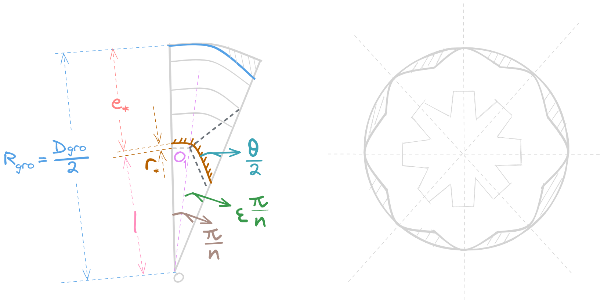
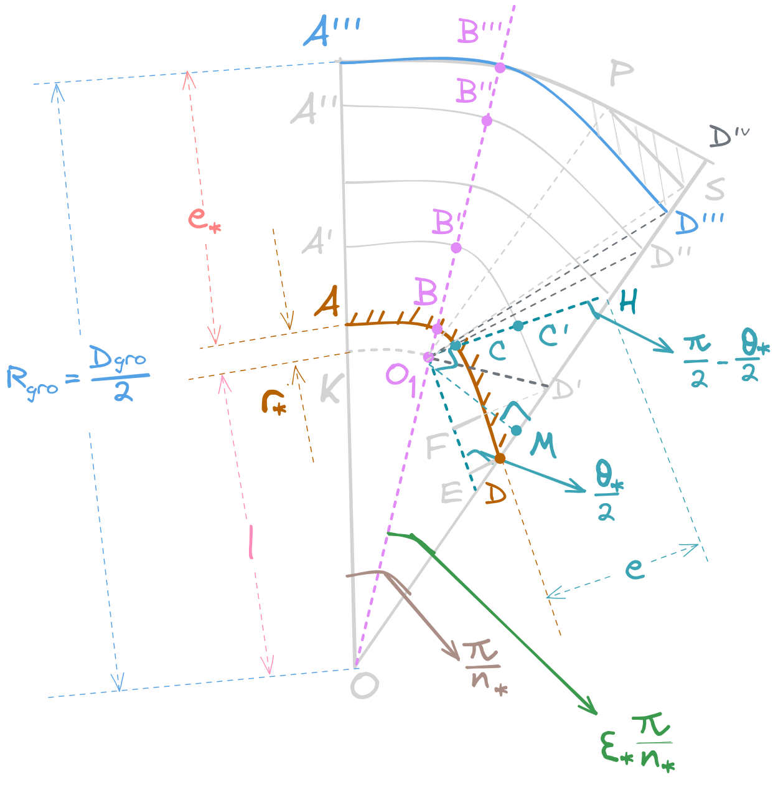
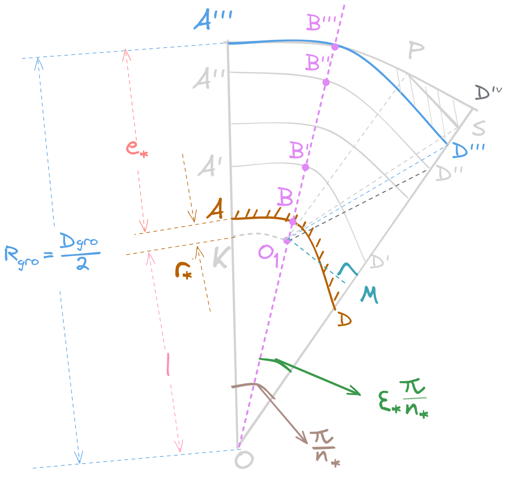
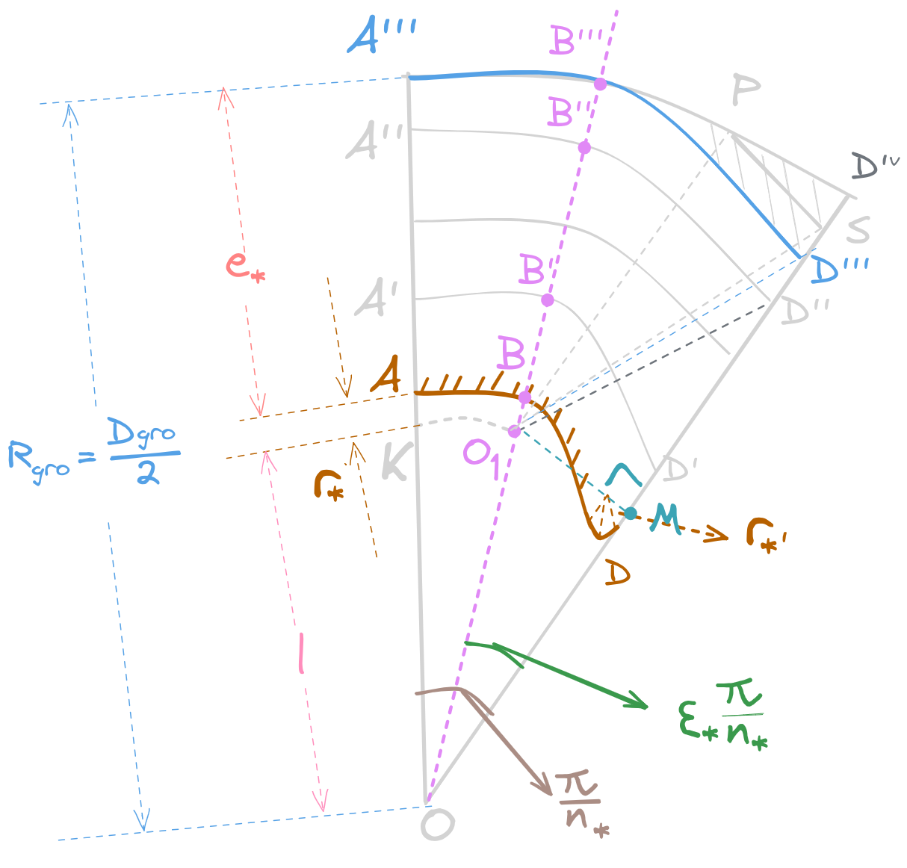
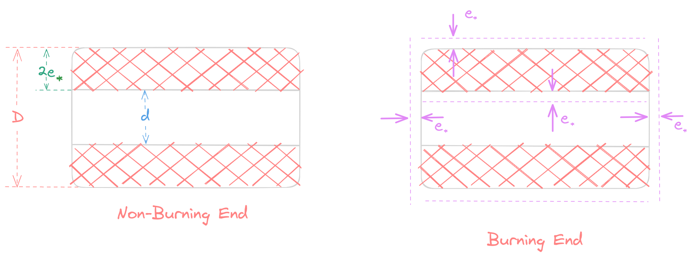
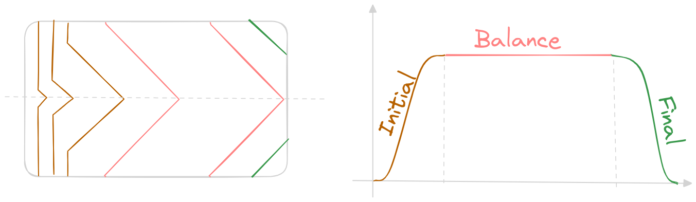
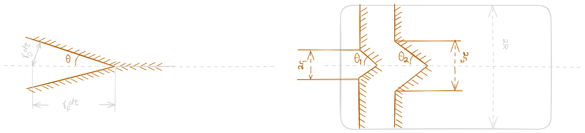
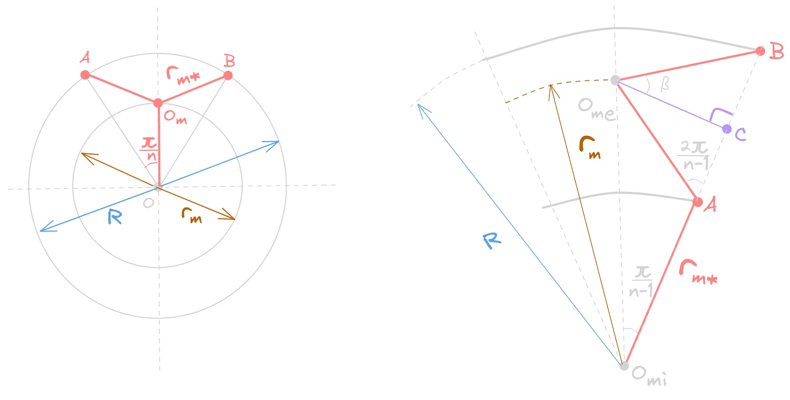
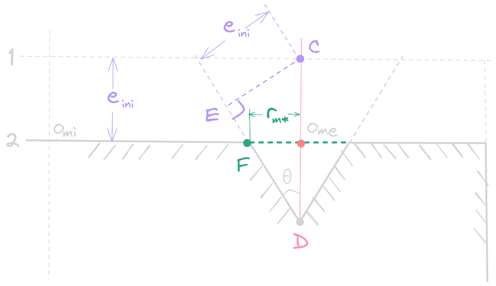

# 药柱设计

## 概述

1. 药形、药柱和装药：
    - 药形需满足推力、燃烧时间、燃烧室压强、总冲、质心移动、结构强度等要求
    - 药柱：具有特定几何形状和尺寸的固体推进剂
    - 装药：包含药柱、衬层（贴壁浇铸）、==绝热层==，形成整体
2. 自由装填：成本低，容易检测，小型、中等尺寸
3. 贴壁浇筑：无支撑、性能好、绝热层少、成本高、应力集中多
4. 基本术语：
    - 药形：装药的初始形状，按维数、燃面位置、推力数量、推进剂类型、推进剂数量、特征进行分类
    - 柱形药：装药横截面积轴向不变
    - 等面/增面/减面燃烧：推力、压强和燃烧面积随时间不变、增加、减少
    - 内孔燃烧：燃烧发生在内表面
    - 拖尾：主燃烧过程结束后剩余的推进剂部分
    - 振荡燃烧极限：维持稳定燃烧的最小压力
    - 包覆层：装药表面的涂层、阻燃材料防止装药暴露在燃气中
    - 衬层：未浇铸时在壳体/绝热层表面粘贴的粘性不自燃聚合物，增强粘接性能，缓冲
    （人工脱粘层：装在药柱前后端封头等应力集中区，实现应力释放，一般会和前后端的衬层融合设计）
    - 内绝热层：导热系数较小
    - 肉厚 $W$：装药初始表面到绝热壳体内表面/其他装药交界面最大距离，端面燃烧的肉厚约为装药长度
    - 肉厚分数 $W_{f}$：肉厚 $W$ 与装药外半径 $R_{gro}$ 之比：
    $$W_{f}=\frac{W}{R_{gro}}$$
    - 模数 $m$：装药外半径 $R_{gro}$ 与内表面半径 $R_{gri}$ 之比：
    $$m=\frac{R_{gro}}{R_{gri}}$$
    - 体积装填分数 $V_{f}$：推进剂体积 $V_{gr}$ 和燃烧室容积 $V_{c}$ （不包括喷管）之比：
$$V_{f}=\frac{V_{gr}}{V_{c}}$$

### 评估设计要求

1. 飞行任务决定总冲、期望的推力时间曲线及其偏差等战术技术性能要求
2. 选择合适的装药构型：结构紧凑，燃面足够，小拖尾，小质心变化
3. 选择合适的推进剂：特征速度、机械、弹道、加工制造、羽流、老化
4. 装药结构应具有完整性：绝热层衬层的应力分析，保证结构不被破坏
5. 燃烧时间越长则装药内腔越复杂
6. 加工制造简单低成本

### 重要性能参数

初步设计认为等燃面理想装药，可只关心装药量、燃烧面积等几何参数的确定，详细设计由程序完成。在满足优化准则前提下选择推进剂，协调相关参数，最后确定药柱结构优选方案。
1. 药柱质量 $m_{gr}$ 和体积 $V_{gr}$：
    $$m_{gr}=\frac{fI}{I_{sp}},\,\,\,\,\,\,\,V_{gr}=\frac{m_{gr}}{\rho_{gr}}$$
   其中 $f$ 为冗余系数。
2. 喷喉面积 $A_{t}$ 和燃面 $A_{b}$：
    $$A_{t}=\frac{F}{C_{F}p_{c}},\,\,\,\,\,\,p_{c}=\left( \frac{C^*\rho_{gr}a}{A_{t}} \right)^{\frac{1}{1-n}}A_{b}^{\frac{1}{1-n}}$$
   可根据燃烧时间 $t_{b}$ 或者工作时间 $t_{a}$ 估算平均压强 $\bar p_{c}$ ，$a$ 为推进剂燃速系数，$C^*$ 为推进剂特征速度
3. 肉厚分数（弧厚分数） $\bar e_{*}$ 和 燃烧时间 $t_{b}$：
    $$\bar e_{*}=\frac{2e_{*}}{D_{gro}}=\frac{2r t_{b}}{D_{gro}},\,\,\,\,\,t_{b}=\int^{e_{*}}_{0}\frac{\mathrm de}{ap_{c}^n}$$
   这里 $e_{*}$ 为药柱肉厚（也即肉厚 $W$ ），$D_{gro}$ 为药柱外径，$r $ 为平均燃速，注意有：
    $$r=ap_{c}^n$$
   这里的 $r$ 为线性燃速，也即推进剂药柱表面的燃烧后退速度，$p_{c}$ 为燃烧室的压强，$n$ 为表征燃速对压强敏感程度的燃速压强系数
4. 装填分数（截面装填因子） $\eta$ 和通气参数 $J$ 或 $\partial e$：
    $$\eta=\frac{A_{gr}}{A_{c}},\,\,\,\,\,J=\frac{A_{t}}{A_{p}}=\frac{A_{t}}{A_{c}(1-\eta)},\,\,\,\,\partial e=\frac{A_{b}}{A_{p}}=\frac{A_{b}}{A_{c}(1-\eta)}$$
    其中 $A_{gr}$ 为药柱横截面积，$A_{c}$ 为燃烧室横截面积。这个参数可以表征装填密度 $\Delta$ ，也即药柱质量 $m_{gr}$ 和燃烧室容积 $V_{c}$ 之比：
    $$\Delta=\frac{m_{gr}}{V_{c}}=\frac{A_{gr}\rho_{gr}L_{c}}{A_{c}L_{c}}=\frac{A_{gr}}{A_{c}\rho_{gr}}$$
    药柱长度 $L\approx L_{c}$ ，复杂构型的药柱会用体积装填分数 $\eta_{V}$ 来表示：
    $$\eta_{V}=\frac{V_{gr}}{V_{c}}=\frac{m_{gr}}{\rho_{gr}V_{c}}=\frac{I}{I_{sp}\rho_{gr}V_{c}}$$
    装填分数 $\eta$ 应该尽可能大，但是也会使得通气参数 $J$ 或者 $\partial e$ 增大，从而导致侵蚀燃烧。一般：发动机外径——燃烧室内径——燃烧室截面积——通气参数限制药柱尺寸和装填分数。
5. 长径比：$L_{c}/D_{gr}$，
    - 端面对燃面变化的影响随之减小而增大
    - 侵蚀燃烧对其他参数的敏感性随之增大而增强
    - 高的长径比有增加不稳定燃烧的趋向

### 装药参数确定

1. 单推力装药设计：
    - 计算条件：
        - 燃烧室压强 $p_{c}$
        - 工作时间：$t_{a}$
        - 喉部外径：$R_{t}$
        - 装药外半径：$R_{gro}=R_{c}$（壳体外半径）$-\delta_{c}$（壳体厚度）$-\delta_{i}$（绝热层厚度），不计衬层
        - 肉厚分数：$W_{f}=e/R_{gr}=W/R_{gr}$
        - 推进剂参数：压强指数 $n$ ，特征速度 $C^*$ ，密度 $\rho_{gr} ，比热比 $k$ ，燃烧温度 $T_{g}$ ，气体常数 $R$ 
    - 装药估算结果：
        - 平均燃面：$\bar A_{b}$
        - 装药肉厚：$e$
        - 装药体积：$V_{gr}$
        - 装药质量：$m_{gr}=\rho_{gr}V_{gr}+m_{r}$（余药质量）
2. 单燃速双推力装药计算：
    - 两级推力比：
        $$\varepsilon_{F}=\frac{F_{1}}{F_{2}}=\frac{C_{F1}p_{c1}A_{t}}{C_{F2}p_{c2}A_{t}}$$
    - 推进剂燃速系数：
        $$a=\frac{e}{t_{a1}p_{c1}^n+t_{a2}p_{c2}^n}$$
    - 其他参数：一级装药肉厚，二级装药肉厚，装药体积，装药质量

3. 双燃速双推力装药设计：
    - 缓燃药为 $1$ ，速燃药为 $2$ （两级燃烧，同时烧完剩 $2$ 或依次烧两级）：
    - 重量成分法：
        $$\begin{cases}
        q_{1}=\displaystyle \frac{m_{1}}{m_{1}+m_{2}}\\
        \,\\
        q_{2}=\displaystyle \frac{m_{2}}{m_{1}+m_{2}}
        \end{cases} \Rightarrow \begin{cases}
        \{R_{g},C_{p},C_{v}\}=\{R_{g1},C_{p1},C_{v1}\}*q_{1}+\{R_{g2},C_{p2},C_{v2}\}*q_{2}\\
        \,\\
        T_{g}=\displaystyle \frac{C_{p1}T_{g1}q_{1}+C_{p2}T_{g2}q_{2}}{C_{p1}q_{1}+C_{p2}q_{2}}\\
        \,\\
        C^*=\sqrt{C_{1}^{*\,2}q_{1}+C_{2}^{*\,2}q_{2}}
        \end{cases}$$
         比热比：
            $$k=\frac{C_{p}}{C_{V}}$$
         通常二级燃烧室压强较低，先保证第二级有足够压强；
    - 两级同时燃烧：两级内孔、二级端面
    - 两级先后燃烧：两级侧面、二级端面

### 推进剂选择
主要考虑：能量（比冲，密度）、弹道（燃速、温度敏感系数）、其他

### 药柱构型选择与设计
1. 初步优化设计结果：弹道、质量、容积、长径比
2. 推力-时间曲线
3. 工艺技术状况
4. 结构完整性分析

### 药柱详细设计
药柱几何参数——药柱几何尺寸——迭代——详细尺寸（保证结构完整性和内弹道特性）。模型吹风实验（内弹道气动力干扰等可能造成燃烧不稳定的因素）

### 药柱结构分析
1. 燃烧几何分析（燃面随肉厚变化，药柱平行层燃烧作为几何分析前提）
2. 内弹道验算（变通道、加质、二相、多维、非稳态）
3. 结构分析（载荷、应力，初始应力和点火建压过程，可靠性与破坏分析）

## 二维药柱设计

### 药柱构形
以星形内孔药柱为例：

    

上图中左图为半个星角，右图为药柱横截面

### 主要几何参数
1. 特征尺寸：$l$
2. 星角数：$n_{*}$
3. 星槽圆弧半径：$r_{*}$
4. 星边夹角：$\theta_{*}$
5. 星角系数：$\varepsilon_{*}$
6. 药柱肉厚：$e_{*}$
7. 药柱长度：$L_{gr}\approx L_{c}$
8. 药柱外径：$D_{gro}=2R_{gro}=2(l+r_{*}+e_{*})$
9. 余药肉厚：$e_{r}$

### 主要设计参数：
1. 燃烧面积 $A_{b}$
2. 通道截面积：$A_{p}$
3. 理论余药面积：$A_{r}$

### 几何参数与设计参数的关系
设半个星角的燃烧边长为 $s_{*}$ ，则：
    $$A_{b}=2n_{*}s_{*}L_{gr}$$
燃烧面积 $A_{b}$ 与其他几何参数的关系可以由 $s_{*}$ 与其他几何参数的关系进行表达。半星角的概念图如下：

    

考虑分阶段燃烧，星角的直边 $\overline{CD}$ 消失前后共两个阶段，判据为变化的肉厚 $e$：
    $$e+r_{*} \stackrel{?}{=} l\frac{\displaystyle\sin\varepsilon_{*}\frac{\pi}{n_{*}}}{\displaystyle\cos\frac{\theta_{*}}{2}}$$
1. 圆弧 $\widehat{A'B'}$ 、$\widehat{B'C'}$ 增长，直边 $\overline{C'D'}$ 减小：
    $$e+r_{*} \leq  l\frac{\displaystyle\sin\varepsilon_{*}\frac{\pi}{n_{*}}}{\displaystyle\cos\frac{\theta_{*}}{2}}$$
    注意，此时的肉厚为 $e=\overline{CC'}$，则半个星角的燃烧边长为：
    $$s_{*}=\widehat{A'B'}+\widehat{B'C'}+\widehat{C'D'}$$
    代入得到：
    $$\begin{align*}
    s_{*} =& (l+e+r_{*})(1-\varepsilon_{*})\frac{\pi}{n_{*}}+\\
           & (e+r_{*})\left(\varepsilon_{*}\frac{\pi}{n_{*}}+\frac{\pi}{2}-\frac{\theta_{*}}{2}\right)+\\
           & l\frac{\displaystyle\sin\varepsilon_{*}\frac{\pi}{n_{*}}}{\displaystyle\sin\frac{\theta_{*}}{2}}-(e+r_{*})\cot\frac{\theta_{*}}{2}
    \end{align*}$$
    化简可得：
    $$s_{*}=l\frac{\displaystyle\sin\varepsilon_{*}\frac{\pi}{n_{*}}}{\displaystyle\sin\frac{\theta_{*}}{2}}+l(1-\varepsilon_{*})\frac{\pi}{n_{*}}+(e+r_{*})\left(\frac{\pi}{2}+\frac{\pi}{n_{*}}-\frac{\theta_{*}}{2}-\cot\frac{\theta_{*}}{2}\right)$$
    由于当前肉厚 $e$ 自 $0$ 开始增长到 $e_{*}$，因此燃烧边长 $s_{*}$ 只取决于最后的大括号里的式子，因此在第一阶段的燃烧可以有如下结论：
    $$\begin{cases}
    \displaystyle \frac{\pi}{2}+\frac{\pi}{n_{*}}-\frac{\theta_{*}}{2}-\cot\frac{\theta_{*}}{2} >0,\,\,\,\,\,\text{Progressive Burning}\,\,\,(s_{*}\uparrow)\\
    \,\\
    \displaystyle \frac{\pi}{2}+\frac{\pi}{n_{*}}-\frac{\theta_{*}}{2}-\cot\frac{\theta_{*}}{2} =0,\,\,\,\,\,\text{Neutral Burning}\,\,\,(s_{*}\equiv\text{Const})\\
    \,\\
    \displaystyle \frac{\pi}{2}+\frac{\pi}{n_{*}}-\frac{\theta_{*}}{2}-\cot\frac{\theta_{*}}{2} <0,\,\,\,\,\,\text{Regressive Burning}\,\,\,(s_{*}\downarrow)\\
    \end{cases}$$
    应当注意，符合恒面燃烧的星边夹角 $\bar\theta_{*}$ 只与星角数 $n_{*}$ 有关。
2. 直边 $\overline{C'D'}$ 消失，圆弧 $\widehat{A''B''}$ 、$\widehat{B''D''}$ 增加：
    $$e+r_{*} > l\frac{\displaystyle\sin\varepsilon_{*}\frac{\pi}{n_{*}}}{\displaystyle\cos\frac{\theta_{*}}{2}}$$
   代入：$s_{*}=\widehat{A''B''}+ \widehat{B''D''}$ 可以得到：
   $$s_{*}=(l+e+r_{*})(1-\varepsilon_{*})\frac{\pi}{n_{*}}+(e+r_{*})\left( \displaystyle \varepsilon_{*}\frac{\pi}{n_{*}}+\arcsin\frac{ l\sin\varepsilon_{*}{\displaystyle\frac{\pi}{n_{*}} }  }{e+r_{*}} \right)$$
   化简得到：
   $$s_{*}=l(1-\varepsilon_{*})\frac{\pi}{n_{*}}+(e+r_{*})\left[ \frac{\pi}{n_{*}}+\arcsin\left( \frac{1}{e+r_{*}}\sin\varepsilon_{*}\frac{\pi}{n_{*}} \right)  \right]$$
   两阶段的肉厚分界点为：
   $$e_{d} = l\frac{\displaystyle\sin\varepsilon_{*}\frac{\pi}{n_{*}}}{\displaystyle\cos\frac{\theta_{*}}{2}}-r_{*} $$
   烧到 $e=e_{*}$ 时，第二阶段燃烧结束。
3. 余药燃烧：
    $$e_{r}\geq e > e_{*}$$
    根据几何关系：
    

        
    

    考虑：
    $$e_{r}=\overline{O_{1}D'''}-r_{*}=\sqrt{R^2_{gro}+l^2-2R_{gro}l\cos\varepsilon_{*}\frac{\pi}{n_{*}}}-r_{*}$$
    可以得到余药的燃烧边长为：
    $$s_{*}=\widehat{PS}=(e+r_{*})\angle PO_{1}S$$
    其中：
    $$\angle PO_{1}S=\arccos \frac{(e+r_{*})^2+l^2-R^2_{gro}}{2(e+r_{*})l} -\frac{\pi}{2}+\varepsilon_{*}\frac{\pi}{n_{*}}-\arccos\left( \frac{l}{e+r_{*}}\sin\varepsilon_{*}\frac{\pi}{n_{*}} \right)$$
将上述计算得到的半星角燃烧边长 $s_{*}$ 代入：$A_{b}=2n_{*}s_{*}L+{gr}$ 即可的得到对应的燃面面积。

### 通道截面积 $A_{p}$
首先明确以下几何参数：
1. 初始通道截面积 $A_{pi}$
2. 半星角通道截面积 $A_{p*}$（仅讨论第一阶段的，因此燃烧边长按第一阶段的公式来算）
3. 以 $O$ 为圆心的扇形：$\nabla KOO_{1}$

参考下图：

    

可以计算半个星角的通道截面积：
$$A_{p*}=A_{\nabla KOO_{1}}+A_{\Delta O_{1}OE} + \int^{e+r_{*}}_{0}s_{*}\mathrm d(e+r_{*})$$
其中有：
- 扇形 $\nabla KOO_{1}$ 的面积：
    $$A_{\nabla KOO_{1}}=\frac{1}{2}l^2(1-\varepsilon_{*})\frac{\pi}{n_{*}}$$
- 三角形 $\Delta O_{1}OE$ 面积：
    $$A_{\Delta O_{1}OE}=\frac{1}{2}\left(l\cos\varepsilon_{*}\frac{\pi}{n_{*}}-l\sin\varepsilon_{*}\frac{\pi}{n_{*}}\cot\frac{\theta_{*}}{2}\right)\cdot l\sin\varepsilon_{*}\frac{\pi}{n_{*}}$$
- 积分：
    $$\begin{align*}
    \int^{e+r_{*}}_{0}s_{*}\mathrm d(e+r_{*}) =& l(e+r_{*})\left[\frac{\displaystyle\sin\varepsilon_{*}\frac{\pi}{n_{*}}}{\displaystyle\sin\frac{\theta_{*}}{2}}+(1-\varepsilon_{*})\frac{\pi}{n_{*}}\right]+\\
    & \frac{1}{2}(e+r_{*})^2\left(\frac{\pi}{2}+\frac{\pi}{n_{*}}-\frac{\theta_{*}}{2}-\cot\frac{\theta_{*}}{2}\right)
    \end{align*}$$

叠加后可以得到面积：
$$\begin{align*}
A_{p*} =\,\, &\frac{1}{2}l^2(1-\varepsilon_{*})\frac{\pi}{n_{*}}+\\
         &\frac{1}{2}\left(l\cos\varepsilon_{*}\frac{\pi}{n_{*}}-l\sin\varepsilon_{*}\frac{\pi}{n_{*}}\cot\frac{\theta_{*}}{2}\right)\cdot l\sin\varepsilon_{*}\frac{\pi}{n_{*}}+\\
         &l(e+r_{*})\left[\frac{\displaystyle\sin\varepsilon_{*}\frac{\pi}{n_{*}}}{\displaystyle\sin\frac{\theta_{*}}{2}}+(1-\varepsilon_{*})\frac{\pi}{n_{*}}\right]+\frac{1}{2}(e+r_{*})^2\left(\frac{\pi}{2}+\frac{\pi}{n_{*}}-\frac{\theta_{*}}{2}-\cot\frac{\theta_{*}}{2}\right)
\end{align*}$$
通道截面积为 $A_{p}=2nA_{p*}$。为满足工艺需要，星根角处会有一段圆弧$r_{*'}$：

    

第一阶段燃烧为减面燃烧的星形药柱，由于 $r_{*'}$的出现会出现一段增面燃烧，第一阶段的燃面最大值会延后，且数值降低，对于降低初始压强峰以及提高装填分数有利。

### 余药截面积 $A_{r}$

燃烧到 $e_{*}$ 时工作结束，剩下的 $B'''D''D'''$ 为余药，设半个星角的余药燃烧面积为 $A_{r*}$ ，则：
$$A_{r*}=A_{\Delta B'''OD^{IV}}-A_{\Delta B'''O_{1}D'''}-A_{\Delta D'''O_{1}O}$$
代入计算得到：
$$\begin{align*}
A_{r*}= &\frac{1}{2}(l+e_{*}+r_{*})^2\varepsilon_{*}\frac{\pi}{n_{*}}-\\
& \frac{1}{2}(e_{*}+r_{*})^2\left[ \varepsilon_{*}\frac{\pi}{n_{*}}+\arcsin\left(\frac{l}{e_{*}+r_{*}}\sin\varepsilon_{*}\frac{\pi}{n_{*}}\right) \right]-\\
& \frac{1}{2}\left[ l\cos\varepsilon_{*}\frac{\pi}{n_{*}}+\sqrt{ (e_{*}+r_{*})^2-l^2\sin^2\varepsilon_{*}\frac{\pi}{n_{*}} } \right]l\sin\varepsilon_{*}\frac{\pi}{n_{*}}
\end{align*}$$
代入公式：$A_{r}=2n_{*}A_{r*}$ 即可计算得到余药的截面积 

### 药柱几何参数确定

经验值：
1. 取模数 $m=\displaystyle \frac{R_{gro}}{R_{gri}}= 1+\frac{e_{*}}{l+r_{*}}$，可参考肉厚分数 $\bar e_{*}$ 综合考虑，一般取 $3\sim 4$
2. 星槽圆弧半径 $r_{*}=(0.015\sim 0.03)D_{gro}$
3. 星根小圆弧半径 $r_{*'} < r_{*}$
       
## 三维药柱设计
1. 燃面就按解析法
2. 计算机图形学装药设计
3. 离散方法装药数值计算

## 小型发动机用药柱

### 管形药柱设计

1. 单根管形药柱设计
    

        
    

    - 几何参数：$D$（外径）$\times d$（内径）$-L$（药柱长）$\times n$（根数）
    - 两端面阻燃管形药柱肉厚 $e_{*}$
        $$e_{*}=\frac{1}{4}(D-d)$$
      若 $L <\displaystyle \frac{1}{2}(D-d)$ ，则药柱为药饼，$e_{*}=\displaystyle \frac{1}{2} L$。两端阻燃的药柱为恒面燃烧，内外侧同时烧，燃面面积：
        $$A_{b}=n\pi(D+d)L$$
    - 两端面不阻燃的药柱为减面燃烧，燃面面积：
        $$A_{b}=n\pi[(D-2e_{*})+(d+2e_{*})](L-2e_{*})+\frac{n\pi}{2}[(D-2e_{*})^2-(d+2e_{*})^2]$$
      燃烧结束时 $e=e_{*}=\displaystyle \frac{1}{4}(D-d)$，可以用初始燃面表示燃面公式。
    - 计算流程：$I\rightarrow V_{gr}$；$(p_{c}, F)\rightarrow (A_{t}, A_{b})$；$t_{b}\rightarrow e_{*}$；$(D_{c}, A_{p}, J_{p})\rightarrow (D,d)$
2. 多根管形药柱尺寸的确定
    - 药柱装填与其几何尺寸及根数的关系（空心塞管，管内挖洞）
    - 通气参量 $\partial e$ 和几何尺寸以及根数 $n$ 的关系（取 $k=\displaystyle \frac{\partial e_{i}}{\partial e_{o}}$ ）
    - 装填分数 $\eta$ 和药柱几何尺寸及根数的关系
    - 肉厚分数 $\bar e$ 和 $n,k$ 的关系（$\displaystyle \bar D=\frac{D}{D_{c}},\,\,\,\bar d=\frac{d}{D_{c}},\,\,\,\bar e_{*}=\frac{2e_{*}}{D_{c}}$，两端阻燃）
    - 药柱质量 $m_{gr}$、通气参量 $\partial e$ 和 $n,k$ 的关系

### 含金属丝端燃药柱

    

1. 端面燃烧：药形简单，$\eta_{V}$ 高，药柱强度好，工作时间长，燃面小，推力小。
   金属丝导热系数为推进剂的 $300\sim 500$ 倍，定向排列长金属丝（垂直端面）/随即加入短金属丝纤维，后者燃速小于前者
2. 嵌入长金属丝药柱燃烧过程：
    

        
    

    - 药柱燃烧：起始（轴心圆锥孔）——平衡（锥面到达外缘不变）——结尾（减面燃烧）
    - 设 $\gamma_{0}$ 为药柱基体的燃速，$\gamma_{f}$ 为沿金属丝的燃速，$\theta$ 为锥角；
    - 起始段：
        $$\sin\theta=\frac{\gamma_{0}\mathrm dt}{\gamma_{f}\mathrm dt}=\frac{r_{0}}{r_{f}}=\frac{1}{K}=\frac{a_{0}}{a_{f}}p_{c}^{n_{0}-n_{f}}$$
        - $n_{f} < n_{0}$：$\theta$ 随燃烧室压强上升而增加
        - $n_{f} > n_{0}$：$\theta$ 随燃烧室压强上升而减小
        - $n_{f} = n_{0}$：$\theta$ 不随燃烧室压强变化
    - 平衡段：
        - 加入金属丝后，燃面变化、燃速、推力均增加 $K$ 倍，压强变化取决于 $n_{f}, a_{f}$
        - 燃面：$\displaystyle \frac{A_{b,0}}{A_{b,f}}=\sin\theta =\frac{1}{K}$
        - 压强：$\displaystyle p_{f}=\left( C^*\rho_{gr}a_{f}\frac{A_{b,0}}{A_{b,f}} \right)^{\frac{1}{1-n_{f}}}$
        - 推力：$F=I_{sp}\rho_{gr}\gamma A_{b,f}=I_{sp}\rho_{gr}\gamma A_{b,0}K$
3.  金属丝燃烧机理：计算$\gamma_{f}$
    - 假设金属丝无限长，温度分布一维
    - 取一小段控制体，分暴露在燃气中的金属丝、金属丝向推进剂的有效传热长度 $L_{\xi}$、剩余长度，一共三个部分
    - 列温度分布传热方程、边界条件、三截面能量方程（补充方程）求解 $\gamma_{f}$。
4.  影响 $\gamma_{f}$的因素：
    - 金属丝材料（热扩散系数 $a_{m}=\displaystyle \frac{\lambda}{C_{p}\rho_{gr}} \uparrow \sim \gamma_{f}\uparrow $ ）
    - 金属丝直径 $d_{m}\uparrow \sim \gamma_{f}(\uparrow -\downarrow)\sim n_{f}\downarrow$
    - 燃烧室压强 $p_{c}\uparrow\sim \gamma_{f}\uparrow$
    - 推进剂
    - 双金属丝问题：高熔点金属包在导温系数（热扩散系数）$a_{m}$ 的金属之上
    - 化学涂层：惰性物质涂层隔热、氧化物质涂层提高燃速且降低压强指数
5. 嵌入长金属丝药柱设计：
    - 推力要求计算 $\gamma_{f}$
    - 选择金属丝材料和直径
    - 确定金属丝根数和排列位置：
        

            
        

        - 排列位置：
            * 端面半径为 $R$，嵌入 $n_{m}$ 根金属丝，药柱轴心为 $O$，金属丝圆心为 $O_{m}$，且金属丝均匀分布在半径为 $r_{m}$ 的圆上 
            * 金属丝 $O_{m}$ 影响的扇形 $\nabla OAB$（上左图），$O_{m}$ 同时烧到 $A,B,O$ 才可以使得==起始段燃烧时间最短==：
                $$\overline{O_{m}A}=\overline{O_{m}B}=\overline{O_{m}O}=r_{m}=r_{m*}=\frac{R}{2\displaystyle \cos\frac{\pi}{n_{m}}}$$
              由此可以确定半径比 $r_{m}/R$ 和根数 $n_{m}$ 的关系。
            * 如果嵌入的金属丝数目较多（上右图），可在中间放一根 $O_{mi}$ ，其他的金属丝 $O_{me}$ 均匀分布在半径为 $r_{m}$ 的圆周上，满足起始段燃烧时间最短必须有：
                $$\overline{O_{mi}A}=\overline{O_{me}A}=\overline{O_{me}B}$$
              根据三角关系可以得到：
                $$\frac{r_{m*}}{R}=\frac{\displaystyle 2\cos\frac{\pi}{n_{m}-1}}{1+\displaystyle 2\cos\frac{2\pi}{n_{m}-1}}$$
              可列表求解 $n_{m}$ 与 $r_{m}/R$ 的关系
        - 金属丝根数
            * 一般取 $n_{m}>5$
            * 起始段烧去的肉厚 $e_{ini}$ 和圆锥底面半径 $r_{m*}$ 的关系，注意，金属丝周围的==基础燃速相等==（见下图）
                $$r_{m*}=\frac{e_{ini}(1-\sin\theta)}{\cos\theta}$$
              代入之前讨论的两种燃烧半径可以得到对应的起始段燃烧肉厚 $e_{ini}$ 和根数 $n_{m}$ 的关系，再根据基础燃速 $\gamma_{0}$ 即可得到起始段燃烧时间 $t_{ini}$ 和根数 $n_{m}$ 的关系。
            * 中心无丝的情况：
                $$t_{ini}=\frac{e_{ini}}{\gamma_{0}}=\frac{R\cos\theta}{\gamma_{0}\displaystyle 2\cos\frac{\pi}{n_{m}}(1-\sin\theta)}$$
            * 中心有丝
                $$t_{ini}=\frac{e_{ini}}{\gamma_{0}}=\frac{2R\cos\theta\displaystyle\cos\frac{\pi}{n_{m}-1}}{\gamma_{0}\displaystyle \left(1+2\cos\frac{2\pi}{n_{m}-1} \right) (1-\sin\theta)}$$
            * 注意,考虑工艺性的同时同样需要满足==起始段燃烧时间最短==

    

## 计算机图形学设计
1. 三维几何造型技术
    - 属性信息（简单、复杂、连接）
    - 质量特性计算
    - 三维几何造型系统选型
2. 药柱变量化设计方法原理
    - 推进剂几何燃烧定律（各向同性、同时点燃假设）
    - 实体造型方法（实心体减去空腔）
    - 药柱变量化设计与燃面推移仿真
    - 药柱燃面面积统计算法（布尔运算、基于颜色标识、药柱通气面积和燃烧周长的计算）
    - 药柱设计规则（旋转拉伸倒角，二维+特征，轴对称设计，实体为凸体，二维布尔+实体）
3. 几种常见药柱特征形体定义
    - 药柱外轮廓
    - 药柱芯模特征形体（回转形、翼形、楔形、星形、等截面拉伸、嵌金属丝）

## 离散方法装药数值计算
1. 基于最短距离场的装药燃烧几何分析方法
    - 二维无端面燃烧装药的燃烧几何分析
    - 三维无端面燃烧装药的燃烧几何分析
    - 三维带端面燃烧装药的燃烧几何分析
2. Level Set 方法

## 药柱制造和验收技术要求
1. 推进剂配置
2. 性能（燃速、密度、比冲和特征速度、力学性能、物理参数）
3. 制造和验收要求
