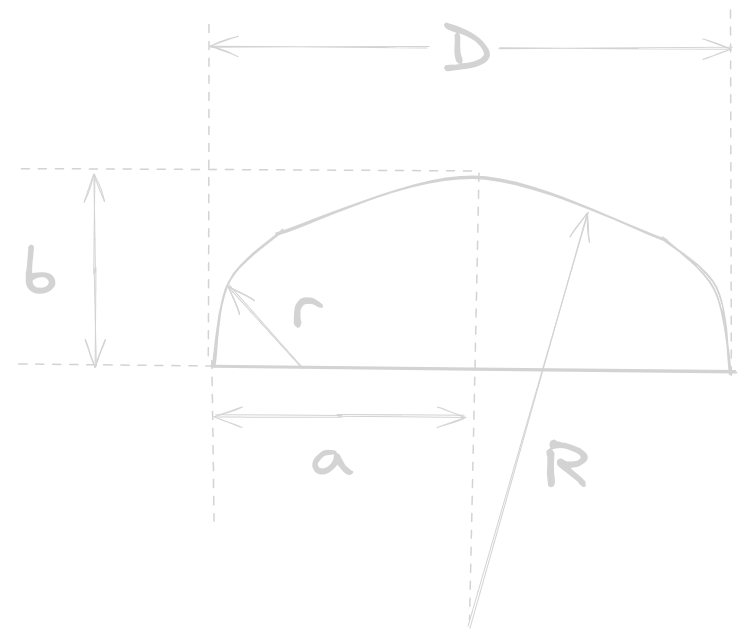
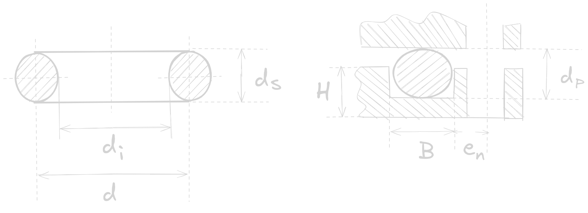
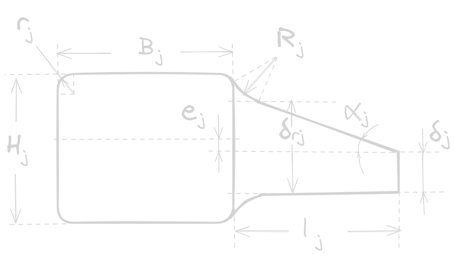
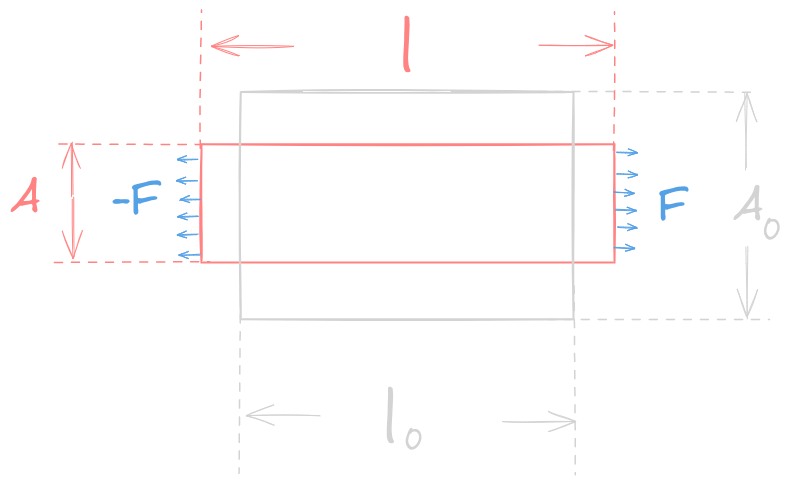
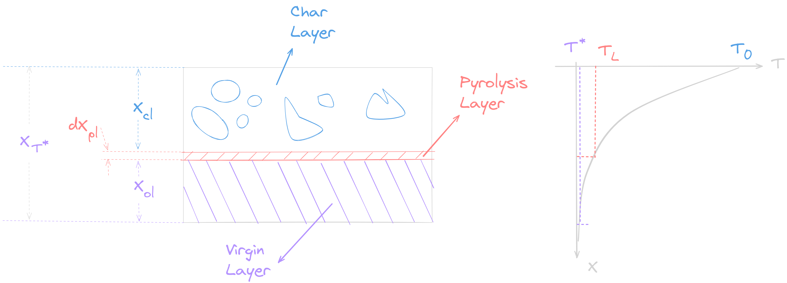

# 燃烧室设计
1. 贴壁浇铸药柱燃烧室：
    - 壳体：承受内压、外载荷
    - 内绝热层：对壳体内壁进行热防护
    - 衬层：防止界面间分子迁移使得药柱和内绝热层粘结更牢固、缓和应力传递
2. 自由装填药柱燃烧室：
    - 壳体：承受内压、外载荷
    - 内绝热层：对壳体内壁进行热防护
    - 挡药板：防止自由装填的药柱移动
3. 壳体材料：
    - 暴露于热燃气：钢材料
    - 内燃装药：铝合金、玻璃增强塑料（低成本、高强度、低密度）
    - 高压力：高强度合金钢、不锈钢（减小应力腐蚀）
    - 纤维缠绕壳体：热固性环氧树脂作为塑料基体（比铝轻、比钢强）
    - 轻质薄壁的金属壳体的应力腐蚀与裂纹扩展（瞬间破坏）
4. 高性能火箭燃烧室的技术要求：
    - 材料强度小偏差
    - 壁厚均匀性和同心度、轴向对准
    - 要求细则：
        - 壳体强度和刚度足够
        - 结构质量尽量轻，药柱装填分数高
        - 结构合理、连接可靠、气密性好、配件有良好的同轴性
        - 材料来源丰富、工艺性好、生产周期短、制造成本低
5. 壳体结构主要设计内容：
    - 确定壳体形状和结构，绘制草图
    - 合理选择材料
    - 壳体应力分析和强度计算
    - 依据设计草图，计算壳体质量
    - 依据设计草图和设计结果，绘制燃烧室壳体部件图，拆绘零件图
    - 制订壳体制造、试验、检验的技术条件
6. 高压容器设计+热防护：设计效率  $\sim \displaystyle \frac{p_{c}m_{c}}{V_{c}}$
 
## 燃烧室壳体结构

1. 经典的燃烧室壳体：圆筒体、前封头、后封头、前裙、后裙、前接头、后接头
2. 封头：半球形、椭球形、碟形、平板，部分末级发动机的前封头有推力终止孔
3. 部分战术导弹发动机的裙和圆筒体可能是一体的，前封头不一定有前接头，后封头可能不存在而让喷管与圆筒体直接连接
4. 依照材料和加工方法，分壳体结构为两类：
    - 金属结构
    - 纤维缠绕结构

### 金属壳体结构

金属壳体相比复合材料壳体的优点：
- 工艺简单、延展性适中、破裂前经历屈服阶段、可承受较高温度（$700+273.13\sim 1000+273.13 K$ ，绝热层较少）
- 金属壳体结构的法兰和接头可承受较大的集中载荷，随时间和气候变化的性能较为稳定
- 密度高，绝热层少，装填分数相对较高

金属壳体设计：
1. 筒体结构：热轧、热冲压毛坯机械加工、旋压成形、焊接、分段
2. 封头结构：

    

- 半球：受力最好
- 椭球：长短轴之比 $m$ 
    $$m=\displaystyle \frac{a}{b}$$
    - $m>\sqrt 2$ 会有压缩纬向应力 
    - $m>2$ 封头强度弱于筒体
    - $m=2$ 封头上最大应力（顶点）和筒体上最大应力相等（一般取 $m=2$）
- 碟形：
    - 半径比 $r/R$ 越小，弯曲应力越大
    - $r$ 一般不得小于封头壁厚的 3 倍，
    - $r$ 无论如何不得小于 $D\times 6\%$ （$D$ 为封头内径）
- 平底：小直径燃烧室
3. 连接结构：
    - 连接可靠、密封性和同轴性好、便于药柱装填或浇铸、容易加工和装配、质量轻
    - 可拆连接：螺纹、螺栓、下环、销钉（前封头和顶盖、后封头和喷管）
    - 不可拆连接：铆接、粘接、焊接（可靠性高、结构简单）、质量轻
4. 密封结构

    

- O 形圈密封：
    - 无需太大的预紧力
    - 受载后压缩变形，燃气压强月高，压紧力越大，密封效果越好
    - O 形圈材料：强度高、会弹性好、耐热耐寒、永久形变量小
    - O 形圈尺寸：名义直径 $d$、内径 $d_{i}$、横截面直径 $d_{s}$、受压后直径 $d_{p}$
    - O 形圈压缩量：$\varepsilon$  （平面固定：$15\%\sim 35\%$，运动/柱面：$10\%\sim 28\%$）
        $$\displaystyle \varepsilon=\frac{d_{s}-d_{p}}{d_{s}}$$
    - 密封槽形状和尺寸：（槽宽） $B$、（槽深）$H$
        $$\frac{B\times H}{\displaystyle \frac{\pi}{4}d^2_{s}}=1.2\sim 1.3$$
        - 应当满足：$B=1.3d_{s},\,\,\,H\approx 0.79d_{s}$
        - 防止 O 形圈被挤入夹缝间隙，$d_{s}+ (1\sim 2$ mm)
        - 连接螺栓和密封槽外圈距离 $e_{n}$ 尽可能小
    - 密封圈回弹性能必须能承受密封面间隙因受压引起的巨大变形。
    - 防止密封圈低温失去回弹力，可填充耐热腻子、增设加热器、选用新材料，适当加粗 $d_{s}$
    - 防止燃气烧蚀密封圈，在接近燃气内侧填充铬酸锌腻子、增设隔热栅（透气性好的陶瓷、钨丝）
- 平垫圈密封

### 纤维缠绕壳体结构
1. 封头和筒体制成整体
2. 缠绕方法：平面、环向、螺旋（平面+环向、螺旋加环向）$\rightarrow$ 壳体环向和轴向强度比
3. 纤维缠绕时的张力应均匀、随壁厚增加而逐渐减小
4. 纤维缠绕壳体一般用金属接头、金属裙或带金属端框的复合裙（轻质高强度铝合金，车制螺纹、钻孔、加工螺孔）

## 金属壳体应力分析和强度计算

### 壳体承受的载荷
1. 内载荷
    - 静载荷：
        - 燃气内压（最基本的载荷）、轴向推力、推力偏斜、惯性力、温度梯度热应力
        - 轴向推力引起的轴向应力、推力偏斜引起的弯曲、剪切应力比内压小的多
        - 有内绝热层，可忽略应力和材料强度下降
    - 动载荷
        - 点火冲击、内压瞬变、不稳定燃烧和推力终止引起的载荷
        - 动内压产生的壳体应力较小，可忽略
2. 外载荷：重力、机械撞击、冲击、振动、加速度载荷、风载、气动加热
3. 连接载荷：辅助装置和壳体连接零部件引起的载荷，拉、压、弯曲、剪切、扭转应力及变形

### 壳体壁厚估算
1. 筒体壁厚：最小壁厚按最大应力强度理论估算
    $$\delta_{c,min}=\frac{p_{c,max}D_{c}}{2\xi [\sigma]},\,\,\,\,\,\,\delta_{c,min}=\frac{p_{c,max}D_{co}}{2\xi [\sigma]+p_{c,max}}$$
    - $p_{c,max}$ 为燃烧室最大工作压强
    - $D_{c},\,\,D_{co}$ 为筒体中面的直径和外径
    - $[\sigma]$ 为设计温度下的许用应力
    - $\xi$ 为焊缝系数
2. 封头壁厚：
    $$\delta_{h}=\frac{p_{c,max}R_{h2}}{2[\sigma]}\left( 2-\frac{R_{h2}}{R_{h1}} \right)$$
    其中 $R_{h1}$ 和 $R_{h2}$ 为封头中面经线和纬线方向的1曲率半径（第一、第二主曲率半径）

### 接头尺寸估算

    

1. 接头加强环的尺寸：
    $$\frac{B_{j}H_{j}}{r_{j}\delta_{j}}=1.20\sim 1.43$$
   前接头尺寸较小取上限，后接头哦尺寸较大取下限
2. 接头锥颈长 $l_{j}$：
    $$l_{j} \geq 0.5\sqrt{max\{R_{j1},R_{j2}\}\cdot \delta_{j}}$$
   其中 $R_{j1}$ 与 $R_{j2}$ 是锥颈与封头连接处的第一和第二主曲率半径
3. 接头锥颈厚度 $\delta_{jr}$：
    $$2\delta_{j}< \delta_{jr} < H_{j}$$
### 应力分析
1. 分解为壳体和零件，写变形方程
2. 依据壳体连续性，写变形协调方程和力平衡方程，求解剪力和弯矩
3. 有限元法
4. 薄膜应力和变形：
    - 壳体母线无突曲则只受拉应力的薄壳称为薄膜
    - 单位长度上的力为薄膜力，其应力叫做薄膜应力
5. 薄壳的弯曲理论（有矩理论）：
    - 连接部位会出现不能由薄膜应力满足的区域，也即不连续区
    - 不连续区有弯曲应力，出现附加内力（剪力和弯矩）
### 强度校核
1. 第一强度（最大正应力）理论：
    $$max(\sigma_{\varphi},\sigma_{\theta})\leq [\sigma]$$
2. 第四强度（最大能量）理论：
    $$\sqrt{\sigma_{\varphi}^2-\sigma_{\varphi}\sigma_{\theta}+\sigma_{\theta}^2}\leq [\sigma]$$
3. 其中 $[\sigma]$ 为许用应力，满足：
    $$[\sigma]=\frac{\sigma_{b}}{f}$$
   这里， $f$ 为安全系数，$\sigma_{b}$ 为强度极限（拉伸试验中断裂前能承受的最大应力，又称抗拉强度，极限强度）
4. 补充： 
    - 连接头或焊缝附近村子偏高的弯曲应力，甚至会超过强度极限，导致校核不通过。
    - 连接部位的应力由薄膜应力和弯曲应力组成，弯曲应力在外表面达到最大值，内表面的弯曲应力与外表面相反。
    - 因此外表面达到最大值且进入屈服极限的时候整体不一定进入塑性状态
    - 材料塑性和韧性较好的壳体在弯曲应力较大的部位，允许的应力会达到 $1.5\sigma_{b}$

## 金属壳体的爆破压强
1. 金属壳体能承受的不被破坏的最大内压
2. 弹性形变用薄膜应力公式预估
3. 制造壳体用的高强度钢为幂函数硬化塑性材料，壁厚变薄可以抵消应变硬化效果
4. 继续塑性变形时内压反而降低，也即“缩颈”之后的拉伸塑性失稳
5. 拉力失稳开始出现时的内压即为爆破压强
    

        
    

6. 爆破压强的计算
    - 自然应力：
        $$\tilde{\sigma}=\frac{F}{A}=\frac{F}{A_{0}}\frac{A_{0}}{A}=\frac{F}{A_{0}}\frac{l}{l_{0}}=\sigma(1+\varepsilon)$$
    - 自然应变：
        $$\tilde{\varepsilon}=\int^{l}_{l_{0}}=\ln\frac{l}{l_{0}}=\ln(1+\varepsilon)$$
      这里的 $A,l$ 为试件受力后的横截面积和长度，$A_{0},l_{0}$ 为试件受力前的初始面积和初始长度
    - 幂函数硬化塑性材料：
        $$\tilde{\sigma}=a\tilde{\varepsilon}^n$$
      其中的 $a$ 为强度系数，而 $n$ 为应变硬化指数（高强度钢 $0 < n < 1$），极限自然应变为 $\tilde{\varepsilon}_{b}=n$
    - 爆破压强的计算：
        $$p_{b}=\frac{h_{0}\sigma_{b}}{R_{0}\lambda}\left( \frac{2}{3}\lambda \right)^*$$
      这里的 $R_{0}$ 是初始半径，$h_{0}$ 为初始壁厚，$\lambda$ 为双轴应力参数：
        $$\lambda=\sqrt{1-\beta_{2}+\beta_{2}^2}$$
      其中的 $\beta_{2}$ 为无因次量：
        $$\beta_{2}=\frac{\tilde{\sigma}_{\varphi}}{\tilde{\sigma}_{\theta}}$$
      上标 $*$ 表示失稳点的值。

## 高强度钢的低应力爆破
1. 低应力爆破（脆性断裂）：壳体应力远低于材料屈服极限时也会发生爆破
2. 材料固有缺陷：裂纹，壳体的低应力爆破从这开始
3. 制成品使用过程也有可能引发宏观裂纹源（介质腐蚀，疲劳载荷）
4. 壳体承载到达临界状态时，材料中固有裂纹会迅速扩展，导致壳体低应力爆破

### 断裂韧性概念

1. 裂纹附近的应力场：
    - 张开型（I 型）：垂直于裂纹表面的拉应力下扩展
    - 滑移型（II 型）：平行于裂纹表面而与裂纹前缘垂直的拉应力下扩展
    - 撕裂型（II 型）：平行于裂纹表面和裂纹前缘垂直的拉应力下扩展
2. I 型应力场强弱程度用应力强度因子表征：
    $$K_{I}=\lim_{r\rightarrow 0}\sqrt{2\pi r}\sigma_{y}z(r,\theta)_{\theta=0}$$
    - 其中 $r$ 为应力场距离裂纹尖端的距离，$\theta$ 为应力场与裂纹平面的夹角，$K_{I}$ 的物理意义为 ==固体材料内由于引入裂纹而反映应力重新分布的力学参数==
    - 应力强度因子 $K_{I}$ 与作用在带裂纹体裂纹尖端出的名义应力 $\sigma_{0}$ 与 裂纹尺寸 $a$ 的关系：
        $$K_{I}=Y\sigma_{0}\sqrt a$$
      其中 $Y$ 为含裂纹物体的几何形状函数（无因次量）
    - $K_{I}$ 到达断裂韧性 $K_{c}$ 之后裂纹急剧扩展：
        $$K_{I}\leq K_{c}$$
      该式为脆性断裂判据。
    - 平面应变条件下材料处于三向拉伸应力状态（张开型裂纹厚板试验），此时的脆性断裂韧性为 $K_{Ic}$，也即判据为 
        $$K_{I}\leq K_{Ic}$$
3. 平面应力条件下进一步讨论脆性断裂判据：
    - 选材和确定尺寸
        - 传统方法的安全系数 $f_{s}$ ：强度极限（屈服强度）$\sigma_{b}$ 和 结构的设计应力 $\sigma_{d}$ 之比：
            $$f_{s}=\frac{\sigma_{b}}{\sigma_{d}}$$
        - 断裂力学的安全系数：
            $$f_{s}=\frac{K_{Ic}}{K_{I}}$$
    - 确定含有缺陷（裂纹）结构的承载能力
        $$\sigma_{0}\leq \frac{K_{Ic}}{Y\sqrt a}$$
    - 确定结构的临界裂纹尺寸
        $$a_{c}\leq \left( \frac{K_{Ic}}{Y\sigma_{0}} \right)^2$$
      其中 $a_{c}$ 为不发生脆性断裂的最大裂纹尺寸（临界裂纹尺寸），结构的使用寿命为初始裂纹尺寸亚临界扩展到临界裂纹尺寸的时间。

### 金属壳体的脆性断裂
1. 金属壳体的板材和焊缝的热响应区内最常见的的是各种表面裂纹，具有代表性的是椭圆形表面裂纹
2. $\phi$ 为椭圆半长轴和短半轴有关的第二类椭圆积分
3. $Q=\phi^2-0.212(\sigma / \sigma_{b})^2$ 为裂纹形状参数，其考虑了裂纹尖端近处存在塑性区域所产生的应力松弛效果
4. 断裂应力为 $\sigma_{f}$，检验表面裂纹最小临界长度应为 $a/b=1$ 的值，详见断裂力学。
 
## 燃烧室壳体的受热与内绝热层设计

1. 药柱燃烧温度：$2500\sim 3900 K$
2. 高温燃气与内壁的热交换十分强烈，工作时间越长受热越严重。

### 传热简析
1. 传热方式：
    - 燃气的对流传热
    - 燃气中金属氧化颗粒的辐射传热
    - 燃气中燃烧的金属和金属氧化物颗粒的碰撞以及沉积传热为
2. 粒子碰撞和沉积主要发生在后封头区，有机械、化学作用，机理复杂，且沉积和碰撞的作用相反，尚且无法计算

### 内绝热层厚度的确定

    

1. 内绝热层在燃气作用下有三层：碳化层、热解层（很薄）、原始层（无变化）
2. 若碳化层无侵蚀现象，则绝热层厚度不变；
3. 针对碳化层和原始层的温度分布的一维导热方程：
    $$\frac{\partial T}{\partial t}=a\frac{\partial^2 T}{\partial x^2}$$
   这里的 $a$ 为热扩散系数：
    $$a=\frac{\lambda}{\rho c}$$
   热解区（碳化区和原始区间的界面）的能量平衡方程：
    $$\left( \lambda_{cl} \frac{T_{0}-T_{L}}{X_{cl}}\right)\mathrm dt=\rho_{vl}q_{pl}\mathrm dX_{pl}+\rho_{vl}\bar C_{vl}(T_{L}-T_{i})\mathrm dX_{pl}$$
   其中：
    - $t$ 为暴露时间
    - $\lambda_{cl}$ 为碳化层的导热系数
    - $T_{i}$ 为初始温度
    - $T_{0}$ 为内绝热层表面温度
    - $T_{L}$ 为内绝热层热解温度
    - $T^*$ 为壳体温度的允许壁温
    - $X_{cl}$ 为分解区的坐标
    - $\rho_{vl}$ 为原始层的材料密度
    - $q_{pl}$ 为内绝热层的热解潜热
    - $\bar C_{vl}$ 是原始区 $T_{i}$ 到 $T_{L}$ 的平均比热 

   注意 $t=0$ 时 $X_{cl}=0$，积分后得到：
   $$X_{cl}=\left\{ \frac{2\lambda_{cl}(T_{0}-T_{L})}{\rho_{vl}[q_{pl}+\bar C_{vl}(T_{L}-T_{i})]} \right\}^{\frac{1}{2}} t^{\frac{1}{2}}=Ct^{\frac{1}{2}}$$
   这里的 $C$ 为碳化率常数。为延缓绝热层的工作时间，必须尽可能减小 $C$ ，因此应增大热解温度 $T_{L}$ 和潜热 $q_{pl}$，但是 $\rho_{vl}$ 太大会增加消极质量。碳化率的计算公式为：
   $$r_{c}=\frac{X_{cl}}{t}=\frac{C}{\sqrt t}$$
   随时间变化。
4. 考虑侵蚀作用的绝热层形成
    - 设侵蚀率 $r_{e} =\mathrm{const}$，能量平衡方程变为：
    $$\left( \lambda_{cl} \frac{T_{0}-T_{L}}{X_{cl}-r_{e}t}\right)\mathrm dt=\rho_{vl}q_{pl}\mathrm dX_{pl}+\rho_{vl}\bar C_{vl}(T_{L}-T_{i})\mathrm dX_{pl}$$
    - 引入符号：
    $$K=\frac{\lambda_{cl}(T_{0}-T_{L})}{\rho_{vl}[q_{pl}+\bar C_{vl}(T_{L}-T_{i})]}$$
    - 求解得到：
    $$t=\frac{K}{r_{e}^2}\left[ e^{-\displaystyle\frac{r_{e}X_{cl}}{K}}-1 \right]+\frac{X_{cl}}{r_{e}}$$
5. 考虑侵蚀作用下，如果把分解区视为碳化区和原始区的分截面，考察绝热层的温度分布：
    - 分截面的能量方程为
    $$\lambda_{vl}\frac{\partial T_{vl}}{\partial x}-\lambda_{cl}\frac{\partial T_{cl}}{\partial x}=q_{pl}\rho_{vl}\frac{\mathrm dX_{cl}}{\mathrm dt}$$
    - 假设碳化深度足够大，可以将碳化层和原始层视为半无限大物体，引入误差函数：
    $$erf(z)=\frac{2}{\sqrt\pi}\int^{z}_{0}e^{\displaystyle -x^2}\mathrm dx$$
    - 假定 $X_{cl}=C_{0}t^{1/2}$，可以推导：
    $$C_{0}=\left\{ \frac{2\lambda_{cl}(T_{0}-T_{L})}{\rho_{cl}q_{pl}} \right\}^{\frac{1}{2}}$$
    - 求解得到对于不同处 $x_{cl}$ 的碳化层的温度 $T_{cl}$ 为：
    $$\frac{T_{0}-T_{cl}}{T_{0}-T_{L}}=\frac{ \displaystyle erf\left( \frac{x_{cl}}{2\sqrt{a_{cl}{t}}} \right) }{\displaystyle erf\left( \frac{X_{cl}}{2\sqrt{a_{cl}{t}}} \right)}$$
    - 求解得到对于不同处 $x_{vl}$ 的原始层的温度 $T_{vl}$ 为：
    $$\frac{T_{vl}-T_{i}}{T_{L}-T_{i}}=\frac{ \displaystyle erf\left( \frac{x_{vl}}{2\sqrt{a_{vl}{t}}} \right) }{\displaystyle erf\left( \frac{X_{cl}}{2\sqrt{a_{vl}{t}}} \right)}$$
    - 内绝热层除了保护燃烧室壳体不被烧坏之外要保证壳体壁温不超过允许壁温 $T^*$ ，防止其过热，将 $T^*$ 代入上式的 $T_{vl}$ 即可得到允许温度所对应的内绝热层厚度 $X_{T^*}$

## 复合材料壳体设计

纤维增强复合材料壳体各向异性，相比于金属壳体：
1. 比强度和比模量高，可减轻结构质量
2. 减振性能好，自然频率与比模量的关系为：
    $$f \propto \frac{E}{\rho}$$
   其自然频率较高，且纤维与基体界面有吸振能力，振动阻尼较高
3. 结构可靠性高，其多相性对裂纹缺陷不敏感，为静不定体系
4. 成形工艺好，工艺简单，适合整体成形，生产周期短。

### 复合壳体设计任务
1. 两个假设
    - 壳体在内压作用下全部载荷由纤维承担，基体起支撑纤维、保护纤维和在纤维之间传递载荷的作用
    - 所有纤维按照理想状态来排布，因此受到相同的轴向拉力的作用。
2. 给定参数：
    - 壳体直径和工作压强（确定壁厚和封头形状）
    - 燃烧室容积、圆筒段半径、壳体总质量等
3. 待定设计：
    - 满足战术技术性能要求下给出封头和壳体结构形式、接头和裙部的结构尺寸参数，复合厚度，缠绕角，绝热层和衬层各点厚度，整个壳体的质量特性，连接螺栓的个数和螺纹尺寸等
    - 针对缠绕发动机的特点，利用网格理论可完成：
        - 力学分析
        - 封头结构特征
        - 壳体接头设计
4. 主要设计任务：
    - 战术技术性能要求。
    - 总体方案选择：环向纤维、螺旋向纤维，胶粘剂材料，缠绕方式，应力平衡常数
    - 子午线设计：计算缠绕角和法向角，给出指定缠绕方式的壳体内型面
        - 平衡型等应力封头设计（理想，但少用）
        - 平面缠绕封头设计（前后开口可以不同来实现平衡型缠绕，潜力较大）
        - 给定封头型面的设计（也可以实现平衡型缠绕但是封头较深，一般为椭球形）
    - 前后接头设计：分析应力应变（强度对抗塑性变形和破坏，刚度对抗弹性变形），设计接头横截面积。
    - 纤维厚度的计算：内压壁厚 $h_{p}$，轴压稳定性壁厚 $h_{T}$，外压稳定性壁厚 $h_{q}$ ，取最大
    - 前后连接裙设计：最大轴压确定厚度，连接尺寸由总体给
    - 绝热层设计：其内型面可提供装药的外型面
    - 设计结果数值分析

### 复合材料壳体设计数学模型
1. 基本线型：螺旋、环向、纵向（平面？）
2. 常用网格：单一螺旋、螺旋环向、螺旋纵向、环向纵向
3. 受力变形：
    $$\alpha > \frac{\pi}{4},\,\,\,\alpha = \frac{\pi}{4},\,\,\,\alpha < \frac{\pi}{4}$$
4. 圆筒轴向坐标为 $Z$ ，环向坐标为 $\theta$。
    - 筒体网格分析（确定纤维厚度）：单一螺旋、螺旋环向
    - 封头网格分析：只能实现螺旋缠绕或平面缠绕
        - 纤维排列关于子午线对称
        - 纤维与子午线夹角 $\alpha$ 为平行圆半径 $r$ 的函数
        - 过平行圆法截面的纤维总量等与过赤道圆法截面的纤维总量等与过圆筒横截面的纤维总量，封头厚度 $h_{f}$ 也为平行圆半径 $r$ 的函数
    - 封头形式选择：
        - 平衡型等应力封头
        - 平衡型平面缠绕封头
   - 给定封头形状（子午线方程 $\rho=\rho(\xi)$ ）的平衡型缠绕

### 接头设计
1. 接头横截面积的确定
2. 肩根部厚度的确定
3. 肩宽比

### 裙部设计
根据材料参数、结构参数、载荷和连接螺栓数量给出最大轴压，进一步确定裙的厚度

### 壳体稳定性分析
1. 壳体外压稳定性经验估算
2. 壳体轴压稳定性经验估算

## 燃烧室壳体制造和验收技术条件

### 一般要求
1. 所有使用的原材料必须符合设计图纸规定的牌号和技术条件
2. 所有钢和铝合金煅件均应按有关标准进行热处理，并进行超声波A级探伤
3. 连接用的螺栓应进行磁力探伤，不允许存在表面划伤、裂纹、夹渣等
4. 加工完毕的壳体应进行几何尺寸测量，满足设计图纸要求，且各配合面、密封面、螺纹等均应妥善加强保护，不得出现划伤、碰损、锈蚀

### 金属壳体的焊接和热处理要求
1. 所有焊缝均应复合设计图纸规定采用的标准，并进行X光检验
2. 非焊接部位不得有焊接飞溅物
3. 壳体按热处理规范进行热处理
4. 配备一定个数量的壳体材料和焊接试片（集体金属拉伸试片、焊接接头拉伸和弯曲试片），分别挂于壳体上、中、下三区与壳体一起进行热处理，随后进行机械性能测试，包括抗拉强度、延伸率、弯曲角、I型断裂韧性等

### 纤维缠绕室壳体加工要求
1. 将纱带宽度和含胶量控制在允放的公差范围内
2. 按图纸要求进行缠绕，不得重叠和架空，并保持纱带受力均匀
3. 按规范将包括内绝热层在内的部位进行强化

### 验收要求
1. 交付的壳体应按任务书要求进行水压次测试和爆破试验
2. 验收压强时，钢壳体一般取最大工作压强的 $1.1\sim 1.2$ 倍，纤维缠绕壳体一般取最大工作压强的 $1.05$ 倍；稳压时间为工作时间
3. 纤维缠绕壳体应进行气密性测试：
    - 充气压强：$300 \,\,kPa$
    - 保持时间：$24\,\,h$
    - 压力下降：$<\,\, 20\,\,kPa$
