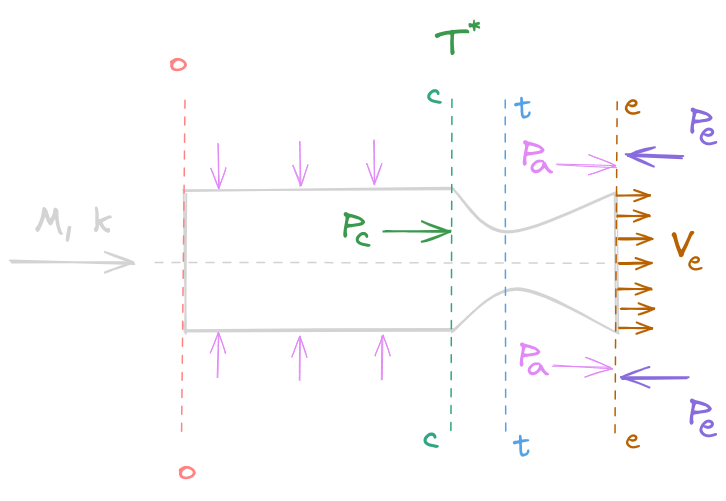

# 比冲

---

## 比冲的物理意义

对于总冲 $I$ ，根据动量定理可以得到总冲的物理意义为产生推力所能持续的时间，也即：
    $$I=\int\|\boldsymbol F\|\mathrm d t\,\,\,\,\,[\mathrm{kg}\cdot\mathrm {m/s, \,\,\,\,\,\mathrm N\cdot \mathrm s}]$$
应当注意，工质产生的推力是会受到当地重力场的影响的，因此对于比冲的讨论应当考虑重力场的问题。另一方面，对于比参数而言，最初始的定义为总参数除以质量，此时的比冲量纲上于与速度一致：
$$I_{sp}=\frac{\mathrm dI}{\mathrm dm}=\frac{\|F\|\mathrm d t}{\mathrm dm}=\frac{\|F\|}{\dot m}=V_{e}+\frac{A_{e}}{\dot m}(p_{e}-p_{a})\,\,\,\,\,[\mathrm{m/s,\,\,\,\,\,N/(kg}\cdot\mathrm{s}^{-1})]$$
其物理意义可以表述为，总冲一定下：
1. 单位质量工质所能产生的冲量大小
2. 单位质量工质所能产生的有效排气速度大小
3. 单位质量流率的工质所能产生的推力大小

为了考虑重力加速度因素，从而获取一个通性的可用于不同重力场下比较的指标，在实际的工程应用领域也有再次除以当地的重力加速度常数得到的比冲定义，此时的比冲量纲上与时间一致：
    $$I_{sp}=\frac{\mathrm dI}{g\mathrm dm}=\frac{\|F\|\mathrm dt}{g\mathrm dm}=\frac{\|F\|}{\dot mg}\,\,\,\,\,[\mathrm{s,\,\,\,\,\,N}\cdot\mathrm{s/(kg}\cdot\mathrm{m/s}^2)]$$
上面的式子的 $\|F\|=ma$ 是用了牛顿第二定律进行了代换的结果，由于重量描述的比冲的量纲与时间一致，这里的物理意义也可以有三种表述，总冲一定下：
1. 当地重力场下，单位重量工质可产生的冲量大小
2. 当地重力场下，单位重量流率工质可产生的推力大小
3. 当地重力场下，单位质量的工质产生单位质量推力可以工作的时间（发动机可以烧多久）

上述对比冲的简单讨论，说明了比冲是反映工质本身的推力性能的重要指标，而与外界的工况和条件无关。并且质量描述的比冲和重量描述的比冲虽然在表述与工程含义不同，但具有着本质相同的物理意义。

## 特征速度
特征速度的定义式为：
$$\dot mC^*=p_{c}A_{t}$$
其只和燃烧室的压力 $p_{c}$ 有关，可根据一维等熵关系式推导得最终式子。应当注意，在计算总压的时候，一般默认燃烧室的压强为总压，燃烧室的温度为总温：
$$p_{c}=p^*,\,\,\,\,\,\,\,\,T_{c}=T^*$$
并且喉部为临界截面，速度为当地声速：
$$A_{t}=A_{cr}, \,\,\,\,\,\,V_{t}=V_{cr}=c_{cr}$$
注意，由气体动力学相关知识，质量流率可以表示为：
$$\dot m=K\frac{p^*A}{\sqrt{T^{*}}}q(\lambda)=K\frac{p^*A_{cr}}{\sqrt{T_{c}}}q(1)=\sqrt{\frac{k}{R}}\left(\frac{2}{k+1}\right)^{\frac{k+1}{2(k-1)}}\frac{p^*A_{cr}}{\sqrt{T_{c}}}$$
则该定义式可以继续展开为：
$$\dot mC^*=p^*A_{t}=p^*A_{cr}=\frac{\dot m\sqrt{T_{c}}}{\sqrt{\frac{k}{R}}\left(\frac{2}{k+1}\right)^{\frac{k+1}{2(k-1)}}}$$
最后化简得到：
$$C^*=\frac{p_{c}A_{t}}{\dot m}=\frac{\sqrt{kRT_{c}}}{k\left(\frac{2}{k+1}\right)^{\frac{k+1}{2(k-1)}}}$$

## 燃速系数
燃速系数 $a$ 来自于圣罗伯特的经验公式：
$$r = ap_{c}^n$$
这里 $r$ 为线性燃速，$p_{c}$ 为燃烧室的压强，$n$ 为压强指数

## 比冲的计算
下面根据喷管的气体动力学原理计算某一高度下的比冲。给出以下参数：
1. 通用气体常数：$\bar R$
2. 工质比热比： $k$
3. 工质摩尔质量：$M$
4. 燃烧室出口总温：$T^*$
5. 燃烧室出口压强：$p_{c}$
5. 喷管出口截面压强：$p_{e}$
6. 某一高度的下外界大气压：$p_{a}$
7. 设计高度下的外界大气压：$p_{ad}$

关于滞止参数的讨论，这里不再做赘述，详见气体动力学相关理论，这里再给出几个假设：

  

1. 一维：每个截面上状态参数均等
2. 绝热：无外界热传递
3. 等熵：无熵流熵产，热力过程可逆
4. 无粘：没有粘性损耗，壁面光滑
5. 可压：$Ma > 0.3$

### 热力学第一定律

