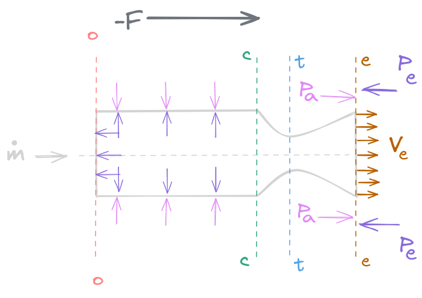
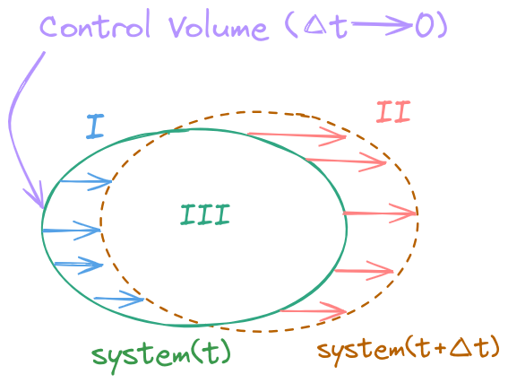

# 火箭推力公式

下图给出固发的结构：

  

一维定常流动，推力由内力和外力构成，内力综合结果平行于轴线，高速喷出工质+反作用力推动火箭飞行，外力只考虑外表面静压强，发动机外表面与外界与其发生相对运动的气流接触会有切向作用力，归到阻力计算（飞行力学）。

$$\boldsymbol F=\boldsymbol F_{o}+\boldsymbol F_{i}$$

这里介绍下雷诺输运方程，下面先从物理量守恒的宏观理论角度推导推力公式，雷诺输运方程的其本质是对控制体物理量的积分描述，这里将控制体（control volume）简化为 $cv$ ，控制体的外表面也即控制面（control surface）简化为 $cs$ ， 系统（system） 简化为 $s$ ：

  

其基本逻辑依旧是多元函数微积分中的本地+随流，也即时间与空间的辩证统一。首先对于一个确定的系统，定义其与质量相关的物理量为 $\Phi$ ，对应的单位质量的物理量为 $\beta$ ，可以得到：

$$\Phi=\int_{cv}\beta\mathrm dm=\int_{cv}\beta\rho\mathrm dv$$

则对于一个确定系统的物理量 $\Phi_{sys}$ ，在一个很小的时间间隔 $\Delta t$ 内，其可以表示为本地的控制体内因变化和外部随流的外因变化：

$$\Delta\Phi_{s}=\Delta\Phi_{cv}+\Phi_{\mathrm{II}}-\Phi_{\mathrm I}$$

利用极限，取变化率可以得到：

$$\frac{\mathrm d\Phi_{s}}{\mathrm d t}=\frac{\mathrm d \Phi_{cv}}{\mathrm dt}+\oint_{cs}\beta(\rho\boldsymbol V\cdot\boldsymbol n\mathrm d A)=\frac{\mathrm d}{\mathrm d t}\int_{cv}\beta\rho\mathrm dv+\oint_{cs}\beta(\rho\boldsymbol V\cdot\boldsymbol n\mathrm d A)$$

这里假设为静止的控制体，则 $\boldsymbol V=\boldsymbol 0$ ，也即：

$$\frac{\mathrm d\Phi_{cv}}{\mathrm dt}=\frac{\partial \Phi_{cv}}{\partial t}+\boldsymbol V\cdot \nabla\Phi_{cv}=\frac{\partial \Phi_{cv}}{\partial t}$$

进一步可以得到：

$$\frac{\mathrm d\Phi_{s}}{\mathrm d t}=\frac{\partial}{\partial t}\int_{cv}\beta\rho\mathrm dv+\oint_{cs}\beta(\rho\boldsymbol V\cdot\boldsymbol n\mathrm d A)=\int_{cv}\frac{\partial}{\partial t}(\beta\rho)\mathrm dv+\oint_{cs}\beta(\rho\boldsymbol V\cdot\boldsymbol n\mathrm d A)$$

$\,\,\,\,\,\,\,\,\,\,$上述的积分关系式即为一般情况下的雷诺输运方程，对于推力公式的推导，我们以定常流某一时刻的 $o-o$ 表面到 $e-e$ 表面的气体为控制体，通过研究气体的受力，再结合牛顿第三定律得到气体对发动机的反作用力，进而得到推力。首先推导质量方程，对于固体火箭发动机而言，其入口封闭，可以认为入口的速度为 $V_{o}=0$ ，此时的物理量为质量 $\Phi=m$， 因此：

$$\dot m=\frac{\mathrm d\Phi}{\mathrm dt}=\frac{\mathrm dm}{\mathrm dt},\,\,\,\,\,\,\beta=\frac{\mathrm d\Phi}{\mathrm dm}=\frac{\mathrm dm}{\mathrm dm}=1$$

注意，对于定常流动，控制体内的当地导数，也即对时间的偏导数为 $0$ ，且质量流率喷射的速度方向和出口界面的外法线方向一致，也即：

$$\dot m=\int^{e-e}_{o-o}\frac{\partial \rho}{\partial t}\mathrm dv+\int_{A_{e}}\rho V\mathrm dA=\int_{A_{e}}\rho V\mathrm dA$$

下面再利用动量方程得到推力公式。令 $\Phi$ 为动量 $I=m \boldsymbol V$ ，以系统受到的合力为 $\Sigma F_{g}$ ，以向左为正方向，取标量式，由动量定理可得：

$$\Sigma F_{g}=\frac{\mathrm d}{\mathrm d t}(mV)=\frac{\mathrm d\Phi}{\mathrm d t},\,\,\,\,\,\,\,\,\,\beta=\frac{\mathrm d\Phi}{\mathrm dm}=\frac{\mathrm d}{\mathrm dm}(mV)=V$$

由于流动为一维定常稳定流动，因此只考虑轴线方向上的力，记系统作用于发动机的推力大小为 $F$ ，方向向左，则发动机反作用于系统的力大小也为 $F$ ，方向向右。需要注意的是，气体在出口对外界存在静压 $p_{e}$ ，于是外界也对系统也存在一个反作用力 $-p_{e}$ ，以及外界通过作用于发动机外壳来抑制系统动力的大气压 $p_{a}$ ， 另一方面又由于稳定流动，控制体内各参数随时间变化率为 $0$，因此：

$$\Sigma F_{g} = -F-p_{a}A_{e}+p_{e}A_{e} = \int_{o-o}^{e-e}\frac{\partial }{\partial t}(\rho V)\mathrm dv+\int_{A_{e}}V(\rho V\mathrm dA)=-\dot mV_{e}$$

最后可以得到推力大小的公式：

$$F=\dot mV_{e}+A_{e}(p_{e}-p_{a})$$

推力方向向左。应当注意，最后的推力公式与最开始提及的内力与外力是一一对应的，从入口速度为 $V_{0}=0$ ，到出口速度 $-V_{e}$ 向右 ，燃气在控制体所在的空间内所受的内力为发动机赋予的向右的内力 $-F_{i}$ 和 喷口 $e-e$ 对外界静压的反作用力 $p_{e}A_{e}$ ，方向向左，依据动量定理：

$$\mathrm dm(-V_{e}-0)=(-F_{i}+A_{e}p_{e})\mathrm dt$$

化简后得到：

$$F_{i}=\dot mV_{e}+A_{e}p_{e}$$

而外力为外界大气压赋予的向右的作用力

$$F_{o}=-A_{e}p_{a}$$

因此推力作为合力的大小仍然为：

$$F=F_{i}+F_{o}=\dot mV_{e}+A_{e}(p_{e}-p_{a})$$
