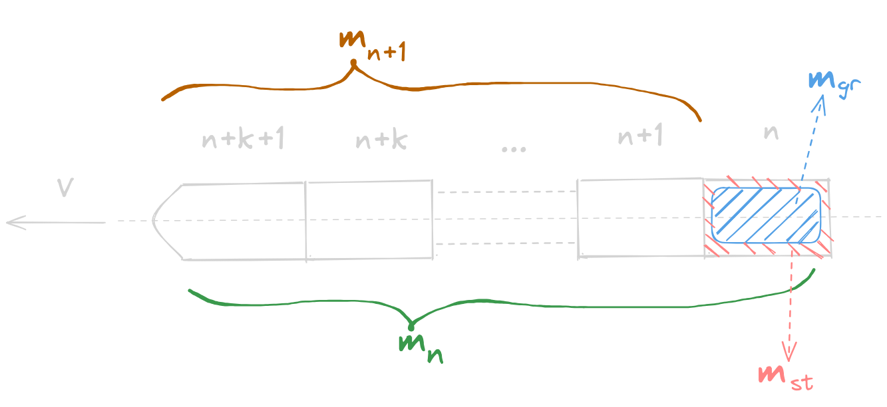

# 齐奥尔科夫斯基公式

齐奥尔科夫斯基的火箭方程主要用于多级火箭发动机的计算，如下图：

  

对于第 $n$ 级火箭发动机而言，其推进过程表现为药柱质量的消耗从而获得排气速度，进而获得推力，给出如下参数：

1. 火箭当前的质量：$m$
2. 火箭当前的速度：$V$
3. 前 $n+1$ 级发动机总载荷：$m_{n+1}$
4. 第 $n$ 级发动机的药柱质量：$m_{gr}$
5. 第 $n$ 级发动机的结构质量：$m_{st}$
6. 第 $n$ 级发动机工作完的剩余质量：$m_{nl}=m_{n+1}+m_{st}$
7. 第 $n$ 级发动机工作前火箭发动机的初始质量：$m_{n}=m_{n+1}+m_{st}+m_{gr}$ 
8. 第 $n$ 级火箭发动机工作完获得的速度增量：$\Delta V$

注意，第 $n$ 级发动机工作完后，其子级的结构会被抛弃。根据动量守恒：
$$mV=(m-\mathrm dm)(V+\mathrm dV)+(V-I_{sp})\mathrm dm$$
由[比冲](比冲.md)的讨论可以知道，工质的比冲只与工质本身有关，整理后得到：
$$I_{sp}\mathrm dm=m\mathrm dV+\mathrm dV\mathrm dm$$
舍去无穷小量，两边同时除以当前火箭的质量 $m$ ，进行积分可以得到：
$$\int^{m_{n}}_{m_{nl}}I_{sp}\frac{\mathrm{d}m}{m}=\int^{n}_{n-1}\mathrm d V$$
也即：
$$\Delta V_{n}=I_{sp}\ln\frac{m_{n}}{m_{nl}}=I_{sp}\ln\frac{m_{n+1}+m_{st}+m_{gr}}{m_{n+1}+m_{st}}=I_{sp}\ln\left(1+\frac{m_{gr}}{m_{n+1}+m_{st}}\right)$$
这里引入一个核心的概念：火箭质量比 $\xi_{n}$ 
$$\xi_{n}=\frac{m_{n}}{m_{nl}}=1+\frac{m_{gr}}{m_{n+1}+m_{st}}$$
上式也即第 $n$ 级发动机工作前的初始质量和工作后的剩余质量（含第 $n$ 级发动机的结构质量）的比值，因此，齐奥尔科夫斯基公式又可以表示为：
$$\Delta V_{n}=I_{sp}\ln\xi_{n}$$
多级火箭比较容易突破质量比的限制，因此如果要有较高的速度，一般会选取多级发动机。
